Olá, sou Thiago Correa, desenvolvedor fullstack. Trabalho no desenvolvimento web criando aplicações completas utilizando Next.js, React, Node.js, TypeScript e JavaScript, além de ferramentas como Zustand, Tailwind, Docker e Git.

Tenho um interesse especial por performance e otimização, buscando manter as aplicações leves, rápidas e bem organizadas, com foco em simplicidade e manutenção a longo prazo.

Também já trabalhei com desenvolvimento mobile usando React Native e criei ferramentas de linha de comando para automatizar e facilitar tarefas.

   

Abaixo estão as tecnologias e ferramentas que utilizo no dia a dia:

   
   
   
   
   
   
   
   
   
   
   
   
   
   
   

 

   

   

   

